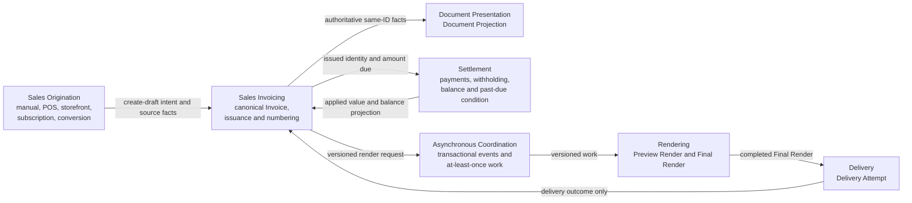

# Billeif Sales Invoice Context Map

This map records ownership and relationships between Billeif contexts. It is a
business architecture map, not a package, database, or deployment diagram.
Definitions used here are normative in [CONTEXT.md](CONTEXT.md).

## Context ownership

| Context | Owns | Does not own |
| --- | --- | --- |
| Sales Origination | Source transaction, source reference, and the intent to create a sales invoice | A separate invoice shape, numbering rules, issuance, or legal invoice content |
| Sales Invoicing | Canonical Invoice, immutable origin, party and line snapshots, version, issuance, Invoice Number, legal lifecycle, and amount due | PDF execution, provider delivery status, or payment-provider processing |
| Document Presentation | Same-ID Document Projection and generic document vocabulary | An independently editable sales invoice or independent legal truth |
| Rendering | Versioned Preview Render and Final Render work and artifacts | Issuance, delivery, settlement, or invoice mutation |
| Delivery | Delivery Attempts and provider delivery outcomes | Legal status, render truth, or settlement status |
| Settlement | Payment and withholding facts, applied value, balance, and past-due condition | Invoice identity, legal content, PDF generation, or email outcome |
| Asynchronous Coordination | Durable event publication, retries, claims, leases, and duplicate suppression | Business authority to invent or alter invoice facts |

## Relationships and contracts

### Sales Origination to Sales Invoicing

**Relationship:** conformist upstream client.

Every origin supplies the canonical create-draft command and source facts. It
conforms to Sales Invoicing validation, party-snapshot, version, idempotency,
pricing, and tenant rules. An origin can retain a reference to its Invoice but
cannot maintain a competing invoice record.

### Sales Invoicing to Document Presentation

**Relationship:** authoritative model to transactional projection.

The Document Projection shares the Invoice identifier and is derived from
canonical Invoice facts. Both sides of a create, edit, or issue transition
commit together. Projection validation detects drift; repair rebuilds from the
Invoice rather than merging competing truths.

### Sales Invoicing to Asynchronous Coordination

**Relationship:** transactional event producer.

The Invoice transition and its event are one commit. Publication after commit
may be attempted immediately, but a durable recovery publisher remains
authoritative for eventual dispatch. Publication failure cannot leave a
committed Invoice without recoverable work, and message publication cannot
precede the business commit.

### Asynchronous Coordination to Rendering

**Relationship:** at-least-once versioned work delivery.

Rendering claims a job for a bounded lease. A repeated message is safe. A
Preview Render for a superseded draft version becomes obsolete. A Final Render
is accepted only for its issued version and is deterministic across retries.

### Rendering to Delivery

**Relationship:** prerequisite artifact provider.

A Delivery Attempt references one Final Render. It waits when the artifact is
not complete and becomes eligible without creating a new business command
when that artifact completes. Delivery never falls back to a Preview Render or
an arbitrary object location.

### Sales Invoicing to Settlement

**Relationship:** invoice identity provider and settlement projection consumer.

Settlement facts reference an Issued Invoice and determine applied value and
balance. The Invoice may expose that projection for reads, but payment records
remain the evidence. Delivery and rendering events cannot change settlement.

## Transaction boundaries

One Sales Invoicing transaction owns:

- the Invoice and its items;
- the same-ID Document Projection and projected lines;
- the activity record;
- the command's idempotency record; and
- any render job and asynchronous event required by the accepted command.

Provider calls, PDF generation, object storage, email transmission, and
payment-provider calls are outside that transaction. They proceed through
idempotent, recoverable workflows after commit.

## Shared invariants

- Every context enforces business tenancy on identifiers and references.
- UUID identity is stable across retries.
- Private artifacts are referenced by object identity, not durable public URLs.
- Consumers assume at-least-once delivery and prove that duplicate or obsolete
  work is harmless.
- Delivery, rendering, settlement, and legal lifecycle histories remain
  independently auditable.
